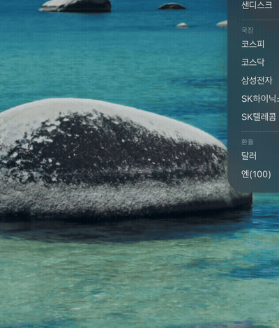
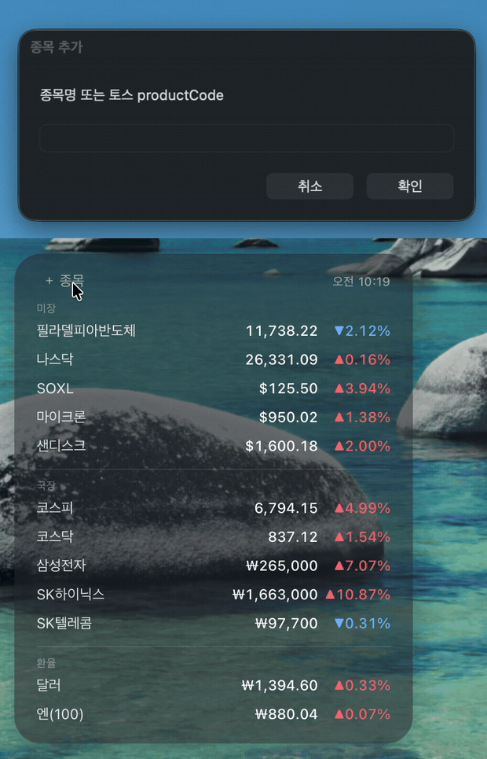

# stocks-widget

macOS 데스크탑에 띄우는 주식 시세 위젯. 토스증권 시세 + 네이버 환율.

- **미장 / 국장 / 환율** 3그룹으로 자동 분리 (응답 통화 기준)
- `＋ 종목` 으로 검색해서 추가, 줄에 마우스 올려 `×` 로 삭제
- 카드를 드래그해 원하는 위치에 배치 (좌표 기억)
- 10초마다 갱신, 프리마켓·데이마켓 반영
- **좌측 시세 / 우측 뉴스** 2열. 좌측 종목을 누르면 우측이 그 종목 뉴스로 바뀐다



10초마다 갱신된다. 카드는 드래그해서 원하는 자리에 둔다.



`＋ 종목` → 종목명 입력 → 검색 결과에서 선택. 위쪽이 다이얼로그, 아래쪽이 위젯이다.

---

## 이 저장소만으로는 동작하지 않는다

이건 독립 실행 앱이 아니라 **[Übersicht](https://tracesof.net/uebersicht/) 위젯**이다.
Übersicht는 데스크탑 배경에 HTML/JSX 위젯을 띄워주는 macOS 앱이고, 이 저장소는 거기에 얹는 위젯 하나다.
따라서 Übersicht를 먼저 깔아야 하고, 이 저장소 파일을 Übersicht가 보는 폴더에 연결해줘야 한다.

```
┌────────────────────────────────────────────────┐
│ Übersicht.app  (외부 앱, 별도 설치)              │
│   └ ~/Library/Application Support/             │
│        Übersicht/widgets/   ← 이 폴더가 cwd     │
│           ├ stocks.jsx ─┐                      │
│           ├ stocks.py  ─┤                      │
└──────┬─────────────────────────────────────────┘
       │ 10초마다 `./stocks.py`
       ▼
   ├─ 토스증권 API (시세·검색)
   ├─ 네이버 API (환율)
   ├─ 이 저장소/stocks.json (내 종목 목록, gitignore)
   └─ 이 저장소/news.json  (뉴스 캐시, gitignore)
                 ▲
                 │ 10분 지났으면 백그라운드로 띄운다
            이 저장소/news.py ──▶ Google News RSS (키 불필요)
```

**뉴스는 왜 캐시를 거치나.** 시세는 10초마다 받아야 하고 뉴스는 10분이면 되는데
Übersicht는 위젯당 `refreshFrequency` 를 하나만 준다. 게다가 `news.py` 는 종목당
1요청이라 10초쯤 걸려서, 10초 명령 안에서 기다리면 시세가 멈춘다.

그래서 `stocks.py` 는 **기다리지 않는다.** `news.json` 이 10분보다 오래됐으면
`news.py` 를 백그라운드로 띄워만 놓고, 출력은 지금 있는 캐시로 즉시 내보낸다.
새 뉴스는 다음 틱(최대 10초 뒤)에 들어온다.

```python
if age > NEWS_TTL:
    os.utime(NEWS, None)        # mtime 을 지금으로 → 다음 틱이 중복 실행하지 않는다
    subprocess.Popen([HERE + "/news.py"], stdout=DEVNULL, stderr=DEVNULL)
return json.load(open(NEWS))["items"]   # 항상 캐시에서 즉시
```

경로는 전부 상대경로다. Übersicht는 widgets 폴더를 cwd로 셸을 띄우므로(`CommandServer(widgetPath)`)
위젯은 `./stocks.py` 만 부르면 되고, `stocks.py` 는 `realpath(__file__)` 옆의 파일들을 읽는다.
`news.py` 도 그 경로로 부르므로 **심링크는 두 개면 된다.**
심링크를 타고 결국 **저장소 안에서** 코드도 데이터도 해결된다. clone 위치를 어디로 잡든 상관없는 이유다.

### 요구사항

| | 왜 필요한가 |
|---|---|
| macOS | Übersicht·osascript가 macOS 전용 |
| Übersicht 1.6+ | 위젯을 띄우는 본체. `import { run } from "uebersicht"` 를 쓴다 |
| `/usr/bin/python3` | 시스템 python3 고정. 없으면 Xcode Command Line Tools 설치 시 함께 깔린다 |

python.org 빌드나 pyenv/conda python은 쓰지 않는다. 인증서가 없어 SSL 검증이 실패한다.
외부 패키지는 하나도 안 쓴다 (표준 라이브러리만).

---

## 설치

```sh
# 1. Übersicht 설치 후 실행 (메뉴바에 아이콘이 뜬다)
brew install --cask ubersicht
open -a Übersicht

# 2. 저장소 clone (위치는 자유)
git clone https://github.com/KooYS/stocks-widget.git ~/Desktop/dev/stocks-widget

# 3. Übersicht 위젯 폴더에 두 파일 심링크
W="$HOME/Library/Application Support/Übersicht/widgets"
R="$HOME/Desktop/dev/stocks-widget"
ln -s "$R/stocks.jsx" "$W/stocks.jsx"
ln -s "$R/stocks.py"  "$W/stocks.py"
```

`stocks.py` 도 같이 걸어야 한다. 위젯이 `./stocks.py` 로 부르기 때문이다.
`news.py` 는 안 걸어도 된다 — `stocks.py` 가 저장소 경로로 직접 부른다.

심링크로 거는 이유: Übersicht는 **정해진 폴더만** 읽고 위젯 경로를 바꿀 수 없다.
원본을 저장소에 두고 링크만 걸어두면 `git pull` 한 번으로 갱신된다.

위젯이 안 보이면 메뉴바 Übersicht 아이콘 → **Refresh All Widgets**.
그래도 없으면 **Widgets…** 에서 `stocks.jsx` 가 목록에 있는지, 체크가 켜져 있는지 본다.

동작 확인:

```sh
./stocks.py | python3 -m json.tool   # tickers / prices / fx / news 네 키가 나오면 정상
./news.py check                      # 뉴스 필터 로직만 검증 (네트워크 불필요)
```

---

## 사용법

| 하고 싶은 것 | 방법 |
|---|---|
| 종목 추가 | 카드 왼쪽 위 `＋ 종목` → 종목명 입력 → 검색 결과에서 선택 |
| 지수 추가 | 같은 다이얼로그에 토스 productCode 직접 입력 (지수는 검색에 안 잡힌다) |
| 종목 삭제 | 해당 줄에 마우스를 올리면 이름 옆에 `×` |
| 위치 이동 | 카드를 드래그. 버튼 위에서 끌면 드래그 안 걸린다 |
| 기사 읽기 | 뉴스 카드에서 헤드라인 클릭 → 기본 브라우저로 열린다 |
| 특정 종목 뉴스만 | **좌측에서 그 종목 줄을 클릭.** 다시 누르면 해제, `‹` 로도 복귀 |
| 뉴스 전체 보기 | 우측 헤더의 `전체 N건` 클릭 |
| 위치 초기화 | Übersicht 개발자도구 콘솔에서 `localStorage.removeItem("stocks-widget-pos")` |
| 뉴스 위치 초기화 | 같은 콘솔에서 `localStorage.removeItem("news-widget-pos")` |

추가/삭제는 저장소의 `stocks.json` 에 바로 반영되고 위젯은 다음 갱신(최대 10초)에 따라온다.
파일을 직접 편집해도 된다 — 순서를 바꾸고 싶을 때가 그렇다. 위젯은 **파일에 적힌 순서 그대로** 그린다.

```json
{
  "SOX.NAI": "필라델피아반도체",
  "A005930": "삼성전자"
}
```

이 파일이 없으면 `stocks.py` 의 `DEFAULT` 목록으로 시작한다.
저장소에 포함하지 않았다 — 사람마다 다르고 클릭할 때마다 바뀌는 개인 데이터라서.

### 종목 코드

토스증권 productCode를 그대로 쓴다. 페이지 URL에서 복사하면 된다.

| 종류 | URL | 코드 |
|---|---|---|
| 국내주식 | `tossinvest.com/stocks/A005930/order` | `A005930` (A + 종목코드) |
| 해외주식 | `tossinvest.com/stocks/US19890516001/order` | `US19890516001` |
| 지수 | `tossinvest.com/indices/SOX.NAI` | `SOX.NAI` |

---

## 뉴스 카드

`stocks.json` 의 종목을 Google News RSS에 하나씩 검색해서 최신 헤드라인을 모은다.
키가 필요 없고 외부 패키지도 안 쓴다 (`xml.etree` 로 파싱).
공식 문서가 없는 비공식 엔드포인트라 예고 없이 바뀔 수 있다.

설계에 반영한 실측 세 가지다.

**1. 지수와 ETF는 뺀다.** 회사가 아니라서 종목명 검색이 의미가 없다.

| | 판별 | 왜 |
|---|---|---|
| 지수 | 코드가 `.NAI` 로 끝나거나 `KGG01P`/`QGG01P` | 종목 뉴스 대신 시황이 잡힌다 ("[마켓뷰] 중동 긴장에…") |
| ETF | 토스 `companyCode` 가 `EF` 로 시작 | `SOXL` 검색 결과가 "여경 코멘토 게시판" 이었다 |

ETF는 코드 모양으로 구분이 안 된다 (`A360750` ETF vs `A005930` 주식). 토스 검색을
productCode로 치면 `companyCode` 가 오는데 여기서 갈린다:

```
EFAMXSOXL     SOXL              ← ETF
EFKSP069500   KODEX 200         ← ETF
005930        삼성전자           ← 주식
NAS116LTR-E0  샌디스크           ← 주식
```

종목 타입은 안 바뀌므로 한 번 조회해 `news-kinds.json` 에 캐시한다(gitignore).
새 종목을 추가했을 때만 한 번 더 물어본다.

**2. 종목을 묶어서 한 번에 못 친다.** `q` 에 `OR` 로 묶으면 요청은 1회로 끝나지만
100건 캡을 대형주가 다 먹는다 — 실측에서 삼성전자 68건, 지엔씨에너지 **0건**이었다.
뉴스가 없는 게 아니라 밀려난 것이다. 그래서 종목당 1요청씩 돌리고 0.3초씩 쉰다.

**3. 최신순 1등이 쓰레기인 경우가 많다.** 세 종류가 관측된다.

```
❌ 시세 봇    "지엔씨에너지 주가, 9월 1일 장중 43,500원 5.64% 하락"
❌ 나열 기사  "8월 31일 주식시장 주요공시" / "월요일 주목받은 주식: 고프로, 테슬라…"
❌ 오매칭     "HD현대삼호" ← 부분 문자열
✅ 진짜       "지엔씨에너지, 창사 이래 최대 규모 수주계약 달성"
```

`q` 에 따옴표 정확일치(`"삼성전자"`)를 걸어 오매칭을 줄이고, 제목 부분일치
블록리스트(`NOISE`)로 나머지를 거른다. 완벽하진 않다 — 티커명이 짧으면
(`SOXL` 등) 여전히 엉뚱한 게 섞인다.

### 보기 방식

카드는 2열이다. 좌측이 시세, 우측이 뉴스. 수집은 7일치를 종목당 25건(`PER_STOCK`),
화면에서 걸러 보여준다. 종목당 요청은 1회뿐이고 RSS가 한 번에 100건씩 주므로,
수집량을 올려도 **요청 수는 안 늘어난다** — 받아놓고 버리던 걸 쓰는 것뿐이다.

| 상태 | 우측에 뜨는 것 | 가는 법 |
|---|---|---|
| 기본 | 종목당 최신 1건씩 | — |
| 종목 | 그 종목 뉴스 전부 | **좌측 종목 줄 클릭** |
| 전체 | 모든 종목 전부, 최신순 | 우측 헤더 **전체 N건** 클릭 |

선택된 줄은 밝게 표시된다. 같은 줄을 다시 누르거나 `‹` 를 누르면 기본으로 돌아온다.
뉴스가 없는 항목(지수·ETF)은 클릭이 안 걸린다.

**우측 높이는 좌측 시세 높이를 따라간다.** 뉴스 목록에 고정 높이를 주면 두 열이
따로 놀아서, `.list` 를 `flex: 1` 로 두고 넘치면 스크롤시킨다. 종목이 적을 때
찌부러지지 않게 `min-height` 만 바닥값으로 둔다.

목록 안에서는 드래그가 안 걸리니 카드를 옮길 땐 헤더나 좌측을 잡는다.

> 선택 상태는 Übersicht의 `updateState`/`dispatch` 로 들고 있다. 위젯 `render` 는
> 컴포넌트가 아니라서 React 훅을 못 쓴다.

```sh
./news.py check   # 네트워크 없이 필터 검증 — 시세봇/나열기사/외부도메인 제거, 최신순, 지수 제외
```

> 헤드라인의 `link` 는 원본 URL이 아니라 `news.google.com` 리다이렉트다. 클릭하면
> `open` 으로 브라우저에 넘기고 브라우저가 따라간다. 이 URL은 셸로 들어가므로
> `news.py` 에서 구글 도메인으로 시작하는 것만 통과시킨다.

---

## 커스터마이즈

전부 `stocks.jsx` / `stocks.py` 상단에 모여 있다.

| 바꾸고 싶은 것 | 위치 |
|---|---|
| 갱신 주기 | `stocks.jsx` 의 `refreshFrequency` (ms) |
| 그룹 순서·이름 | `stocks.jsx` 의 `parse()` 마지막 배열 (`미장` / `국장` / `환율`) |
| 카드 색·크기·폰트 | `stocks.jsx` 의 `className` 템플릿 문자열 |
| 통화기호 없이 표시할 KRW 지수 | `stocks.jsx` 의 `INDEX` (`.NAI` 로 끝나면 자동 처리) |
| 환율 종류 | `stocks.py` 의 `FX`. 네이버 reutersCode를 넣는다 (`FX_EURKRW` 등) |
| 기본 종목 목록 | `stocks.py` 의 `DEFAULT` |
| 뉴스 갱신 주기 | `stocks.py` 의 `NEWS_TTL` (기본 600초) |
| 뉴스 수집량 | `news.py` 의 `PER_STOCK`(종목당) / `LIMIT`(페이로드 상한) |
| 두 열 폭 | `stocks.jsx` 의 `.left` / `.right` `width` |
| 뉴스칸 최소 높이 | `stocks.jsx` 의 `.list` `min-height` |
| 뉴스 검색 기간 | `news.py` 의 `WINDOW` (기본 `7d`) |
| 뉴스 노이즈 필터 | `news.py` 의 `NOISE` 튜플 (제목 부분일치) |

수정 후 저장하면 Übersicht가 알아서 다시 읽는다. 심링크 탓에 감지가 안 되면 Refresh All Widgets.

---

## 개발

```sh
git clone https://github.com/KooYS/stocks-widget.git ~/Desktop/dev/stocks-widget
cd ~/Desktop/dev/stocks-widget
```

clone 위치는 어디든 상관없다. 코드 안에 절대경로가 박힌 곳이 없다 —
`stocks.jsx` 는 `./stocks.py`(widgets 폴더 기준), `stocks.py` 는 자기 옆의 `stocks.json` 을 본다.
빌드도 없고 `node_modules` 도 없다. clone → 심링크 두 개 → 끝.

이미 위젯을 쓰고 있었다면 기존 파일을 치우고 링크로 바꾼다:

```sh
W="$HOME/Library/Application Support/Übersicht/widgets"
R="$HOME/Desktop/dev/stocks-widget"
mv "$W/stocks.jsx" "$W/stocks.jsx.bak" 2>/dev/null
mv ~/.config/stocks.json "$R/stocks.json" 2>/dev/null   # 예전 위치에서 종목 목록 옮기기
ln -s "$R/stocks.jsx" "$W/stocks.jsx"
ln -s "$R/stocks.py"  "$W/stocks.py"
```

`stocks.json` 은 `.gitignore` 에 들어 있다. 종목을 추가/삭제할 때마다 바뀌는 개인 데이터라
저장소에는 안 올라가고, `git pull` 이나 저장소 교체에도 그대로 남는다.
없으면 `stocks.py` 의 `DEFAULT` 로 처음 한 번 만들어진다.

> 실행 중인 Übersicht에서 심링크를 **갈아끼우면** 위젯이 목록에서 빠진 채로 안 돌아온다.
> (파일 감시가 심링크 생성 이벤트를 디렉토리로 오인한다.) 링크를 바꿨으면 Übersicht를 껐다 켠다.

### 고치고 → 확인하는 사이클

| 고친 파일 | 반영 방식 |
|---|---|
| `stocks.py` | 다음 갱신(최대 10초)에 자동 반영. 셸에서 먼저 돌려보는 게 빠르다 |
| `news.py` | `news.json` 이 10분 지나야 다시 돈다. 급하면 `rm news.json` 후 `./stocks.py` |
| `stocks.jsx` | 저장하면 Übersicht가 다시 읽는다. 심링크라 감지가 안 되면 메뉴바 → **Refresh All Widgets** |
| 심링크 자체 | 앱 재시작. Refresh로는 다시 안 잡힌다 |

```sh
./stocks.py | python3 -m json.tool   # 위젯이 받는 것과 똑같은 JSON
./stocks.py del A005930              # 삭제
./stocks.py add                      # 검색 다이얼로그 (GUI 필요)
./news.py check                      # 뉴스 필터 검증 (네트워크 불필요, 즉시)
./news.py | python3 -m json.tool     # 뉴스만 직접 수집 (10초쯤). news.json 도 갱신된다
rm news.json && ./stocks.py >/dev/null  # 캐시 버리고 백그라운드 재수집 트리거
```

위젯이 `시세 없음` 만 띄우면 십중팔구 `stocks.py` 출력이 JSON이 아닌 경우다. 위 명령으로 바로 보인다.

### 로그 보기

메뉴바 Übersicht → **Show Debug Console**. WebInspector가 열리고 `console.log` 와 JSX 에러가 여기 찍힌다.

### 위젯(.jsx) 구조

Übersicht가 JSX를 자체 트랜스파일한다. 특별한 건 `import { run } from "uebersicht"` (셸 명령 실행) 하나뿐이고 나머지는 평범한 React다.
내보내야 하는 것:

| export | 역할 |
|---|---|
| `command` | 10초마다 실행할 셸 명령. `./stocks.py` — cwd는 widgets 폴더다 |
| `refreshFrequency` | 실행 주기(ms) |
| `parse` | `command` 의 stdout(문자열)을 그리기 좋은 형태로 변환 |
| `render` | 상태를 받아 JSX 반환. 2번째 인자로 `dispatch` 가 온다 |
| `initialState` / `updateState` | 선택된 종목 같은 위젯 상태 보관. 훅 대용이다 |
| `className` | 위젯 CSS. 최상위 선택자 없이 바로 속성을 쓴다 |

> **`backdrop-filter` 는 쓰지 말 것.** 간유리 효과를 주면 갱신될 때마다 backdrop이
> 재샘플링되면서 한순간 평균색(=불투명)으로 떠서 배경이 깜빡인다. `will-change` 로
> 레이어를 붙잡아도, 블러를 `::before` 로 분리해도 안 잡혔다. 투명 창이라 배경 알파만
> 줘도 벽지가 비친다 — 두 카드 모두 `rgba(40,44,52,0.6)` 하나로 끝냈다.

### 제거

```sh
W="$HOME/Library/Application Support/Übersicht/widgets"
rm "$W/stocks.jsx" "$W/stocks.py"
```

저장소를 통째로 지우면 `stocks.json`(종목 목록)도 같이 사라진다.

---

## API

셋 다 공개 스펙이 아니다. 예고 없이 깨질 수 있고, 깨지면 위젯은 `시세 없음` 만 띄운다.

| 용도 | 엔드포인트 | 비고 |
|---|---|---|
| 시세 | `wts-info-api.tossinvest.com/api/v3/stock-prices?productCodes=…` | `Referer: https://www.tossinvest.com/` 필요. 없는 코드는 조용히 빠진다 |
| 검색 | `wts-info-api.tossinvest.com/api/v3/search-all/wts-auto-complete` | POST |
| 환율 | `m.stock.naver.com/front-api/marketIndex/prices?category=exchange&reutersCode=FX_USDKRW` | `pageSize` 10 이상만 허용. 엔은 100엔 기준 |
| 뉴스 | `news.google.com/rss/search?q=…&hl=ko&gl=KR&ceid=KR:ko` | 키 불필요. 100건 캡, `start`/`num` 무시. 요약 텍스트 없어 제목이 전부 |

개인용 대시보드 용도다. 응답 순서가 요청 순서와 다르므로 코드에서 다시 정렬한다.

---

## 문제 해결

| 증상 | 원인 |
|---|---|
| 위젯이 아예 안 보임 | Übersicht 미실행, 또는 심링크 경로 오타. Widgets… 목록 확인 |
| `시세 없음` | `stocks.py` 실행 결과가 JSON이 아님. 저장소에서 직접 돌려본다 |
| 심링크를 바꾼 뒤 위젯이 사라짐 | 감시가 다시 안 잡는다. Übersicht 재시작 |
| `./stocks.py: Permission denied` | 실행 권한이 빠졌다. `chmod +x stocks.py` |
| SSL 오류 | `/usr/bin/python3` 가 아닌 python이 잡혔다. `stocks.jsx` 의 `HELPER` 확인 |
| 특정 종목만 안 뜸 | productCode 오타. 토스가 없는 코드를 에러 없이 빼고 준다 |
| 환율만 안 뜸 | 네이버 응답 변경. `stocks.py` 의 `fx()` 확인 |
| 코드를 고쳤는데 그대로 | Refresh All Widgets |
| 뉴스 카드가 비어 있음 | `stocks.json` 에 지수·ETF만 있다. 뉴스는 종목만 대상이다 |
| 특정 종목이 뉴스에 안 나옴 | ETF로 판별됐을 수 있다. `news-kinds.json` 에서 `EF` 접두 확인 |
| 뉴스가 안 바뀜 | `news.json` 이 10분 지나야 갱신된다. `rm news.json` 후 잠시 기다린다 |
| 뉴스칸이 계속 "받는 중" | 첫 실행은 백그라운드 수집이 끝날 때까지 10초쯤 걸린다 |
| 엉뚱한 뉴스가 섞임 | 티커명 오매칭. `news.py` 의 `NOISE` 에 패턴을 추가한다 |
| 뉴스 클릭해도 안 열림 | `link` 가 구글 도메인이 아니면 걸러진다. `./news.py` 로 URL 확인 |
| 종목 줄이 클릭이 안 됨 | 그 종목 뉴스가 없다. 지수·ETF는 원래 대상이 아니다 |
